# Learning RxJava(RxJava详解)  

RxJava的精妙之处就是异步操作极其方便，也就是Schedulers的使用，本项目可以让大家彻底掌握Schedulers的使用，还有常用的操作符、RxAndroid...的使用详解。

## Screenshots
 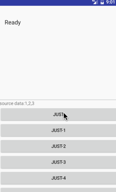
 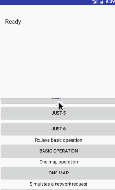
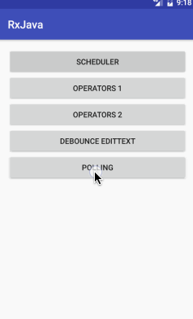
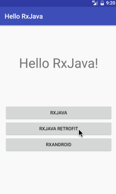

## 详解
我们可以把Schedulers看作线程控制符，一共五种线程控制符，可以通过这些线程控制符切换不同的线程。以下是五种线程控制符的区别：

1. `Schedulers.immediate()` 在当前线程运行，相当于不切换线程。这是默认的 Scheduler。

2. `Schedulers.newThread()`总是启用新线程，并在新线程执行操作。
3. `Schedulers.io()` I/O 操作（读写文件、数据库、网络信息交互等）所使用的 Scheduler。行为模式和 newThread() 差不多，区别在于 io() 的内部实现是是用一个无数量上限的线程池，可以重用空闲的线程，因此多数情况下 io() 比 newThread() 更有效率。不要把计算工作放在 io() 中，可以避免创建不必要的线程。
4. `Schedulers.computation()` 计算所使用的 Scheduler。这个计算指的是 CPU 密集型计算，即不会被 I/O 等操作限制性能的操作，例如图形的计算。这个 Scheduler 使用的固定的线程池，大小为 CPU 核数。不要把 I/O 操作放在 computation() 中，否则 I/O 操作的等待时间会浪费 CPU。
5. `AndroidSchedulers.mainThread()` 切换到主线程，指定的操作将在Android 主线程运行。

` 其实我们常用的就2种：Schedulers.io()和AndroidSchedulers.mainThread()`

> 以下几个例子都是使用Observable.just(1,2,3)创建被观察对象，观察者输出1，2，3. 

####1. 基本使用
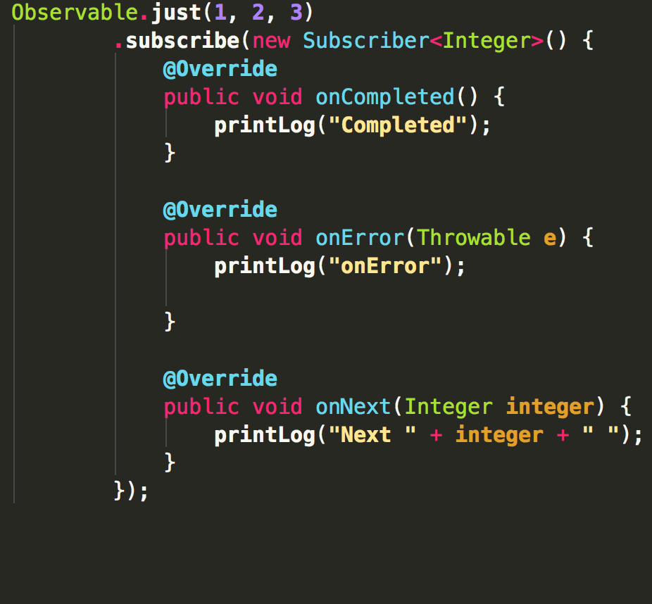
 
 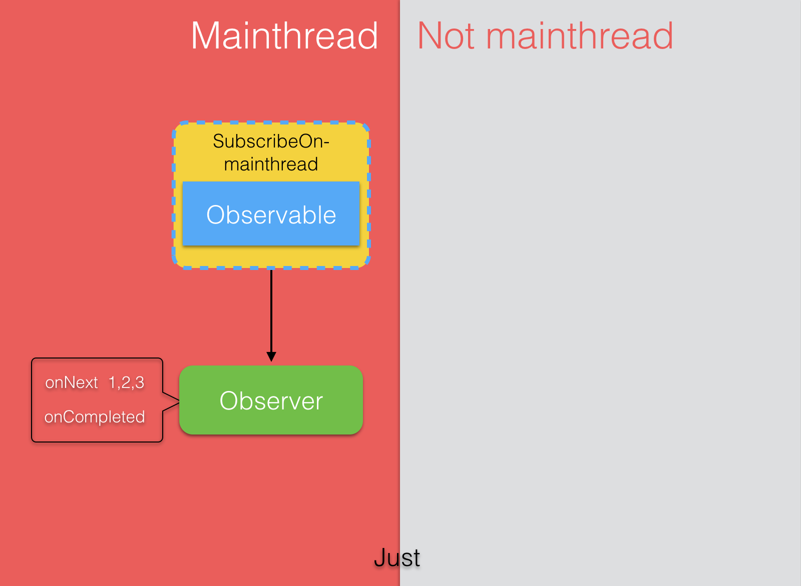
####2. 使用 subscribeOn(Schedulers.io())设置被观察者的线程
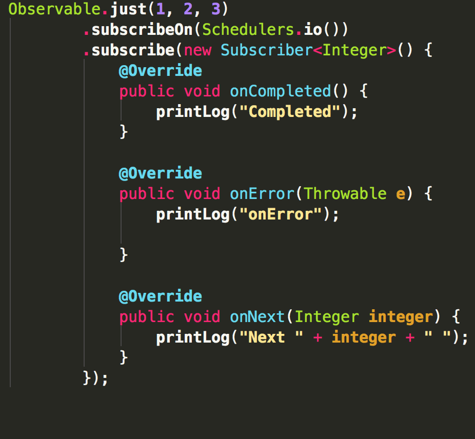
 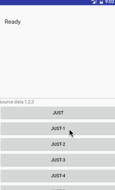
 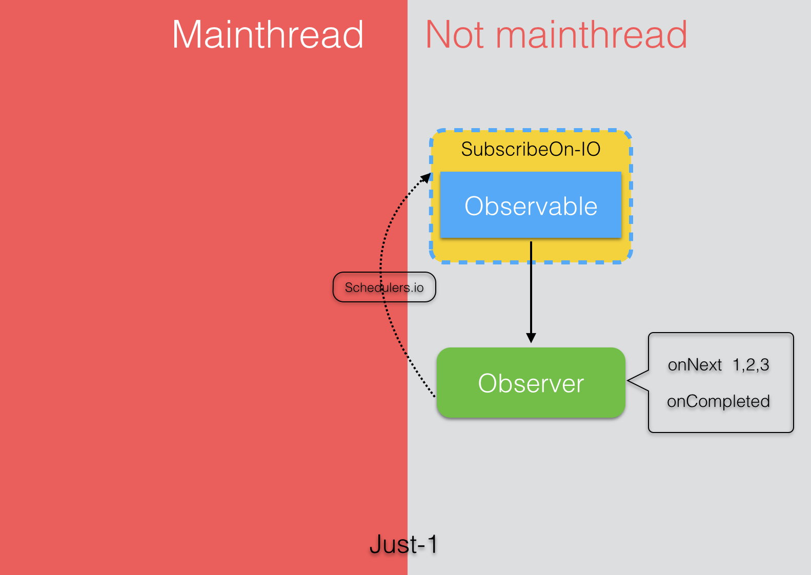 
  > 以下几个例子中看不出被观察者发生在什么线程，使用Observeble.create()创建被观察者可以看出发生在什么线程，可参看源码中的其它Demo。
  
####3. 使用 subscribeOn(Schedulers.io()) 和 observeOn() 设置被观察者和观察者的线程

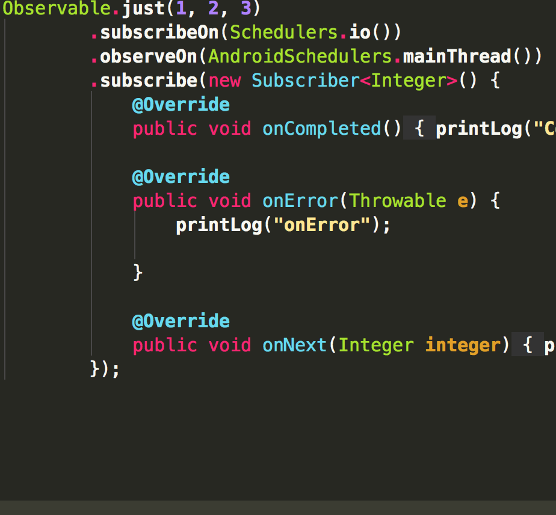
 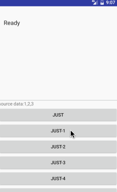
 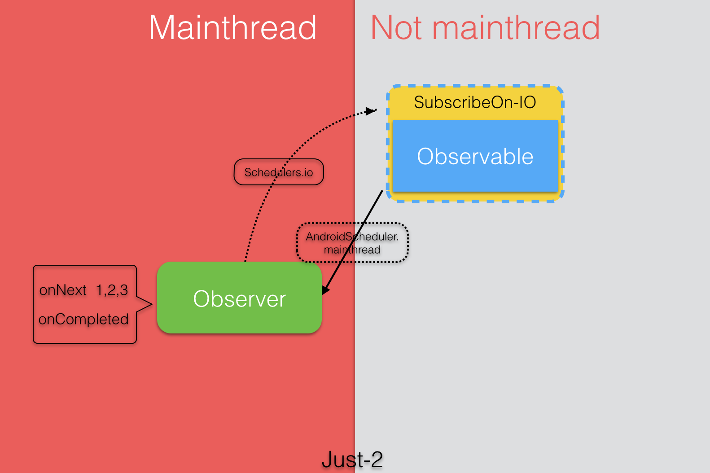  

####4. 使用Schedulers.io()指定被观察者产生事件的线程,然后使用Map对数据转换，这里只是在每个数据后面加‘a’。

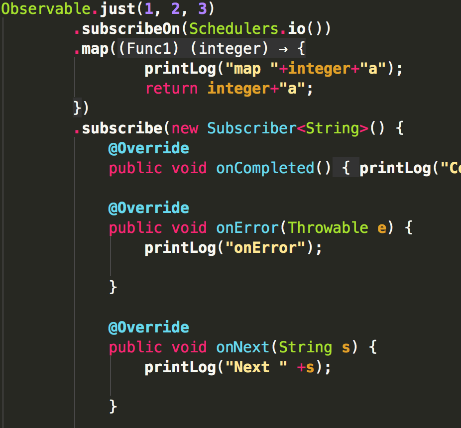
 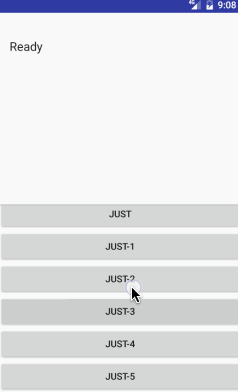
   

 
####5. 使用Schedulers.io()指定被观察者产生事件的线程,使用Map对数据转换，在每个数据后面加‘a’，使用AndroidSchedulers.mainThread()切换到主线程，然后使用Map变换，每个数据后加‘b’，输出结果。

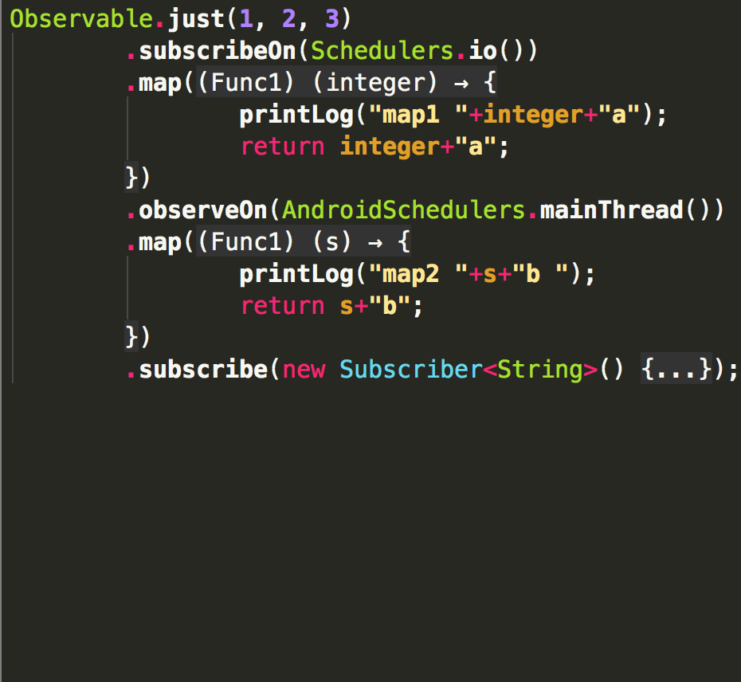
 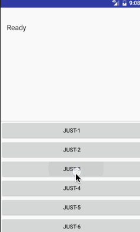
 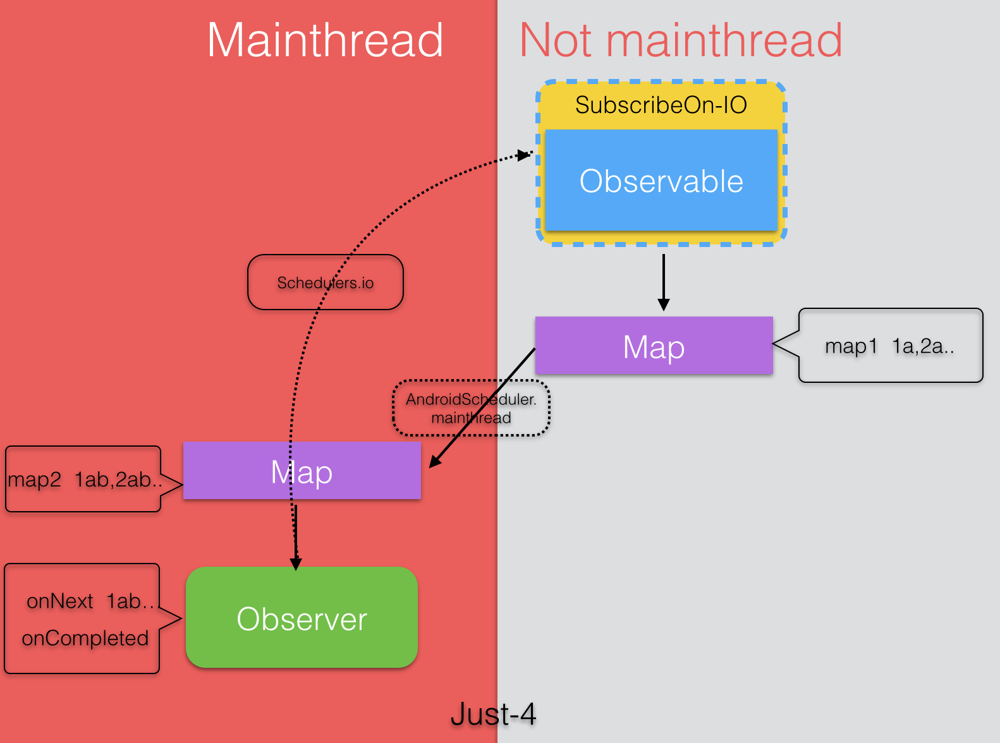  

####6. 使用Schedulers.io()指定被观察者产生事件的线程,使用Map对数据转换，在每个数据后面加‘a’，使用AndroidSchedulers.mainThread()切换到主线程，然后使用Map变换，每个数据后加‘b’，再用Schedulers.io()切换线程，用Map对数据加‘c’，输出结果。

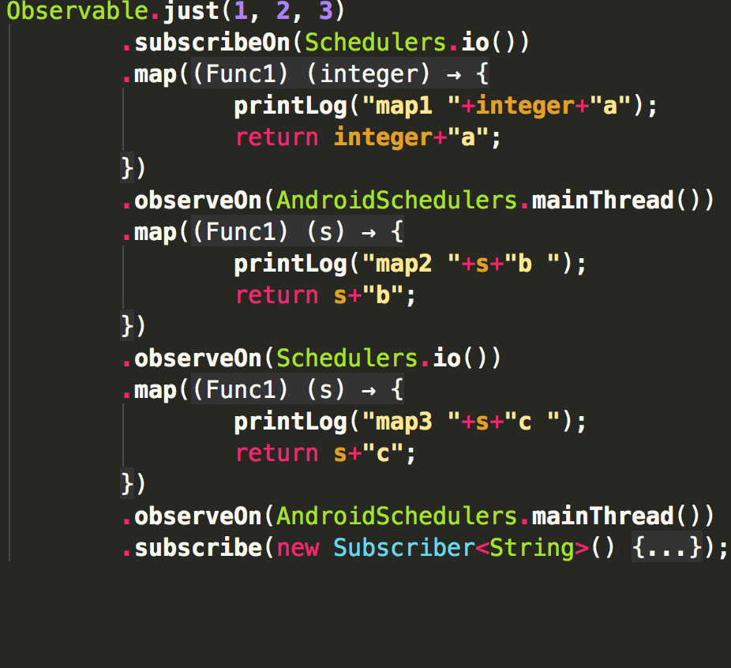
 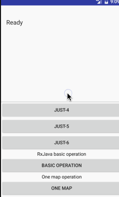
   
 
####7.这个例子不同的是使用了两次subscribeOn()来指定被观察者的线程，最终最上面的subscribeOn()起作用，下面的subscribeOn()不起作用。然后使用Map对数据转换，这里只是在每个数据后面加‘a’，使用Schedulers.io()切换线程，然后使用Map变换，每个数据后加‘b’，再用AndroidSchedulers.mainThread()切换主线程，用Map对数据加‘c’，最后再切换到非主线程，输出结果。

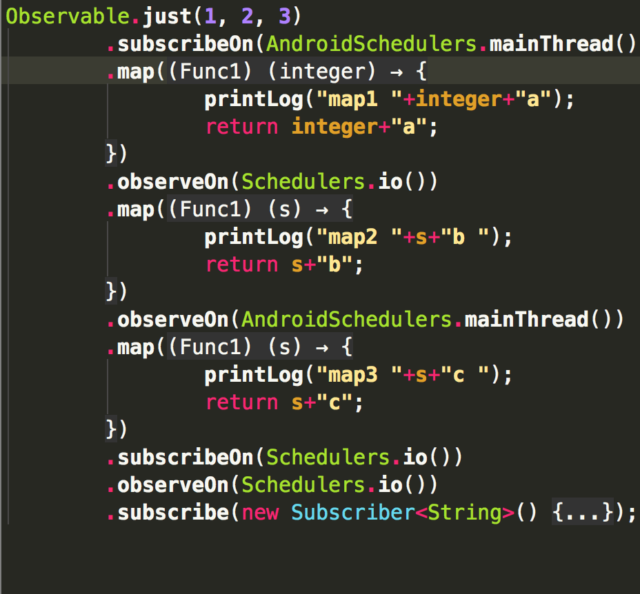
 
 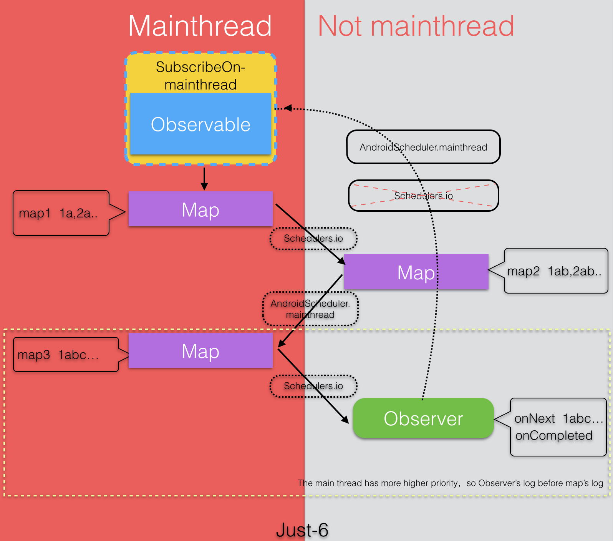
 
>最终发现设置被观察者的线程只有最上面的起作用，下面的不起作用。

`更多的例子请看源码`
 
##About me

An android developer in Beijing.Welcome to offer me an [Interview invitation](mailto:maat.xing@gmail.com). If you have any new idea about this project, feel free to [contact me](mailto:maat.xing@gmail.com). :smiley:

License
=======

    Copyright 2016 Maat

    Licensed under the Apache License, Version 2.0 (the "License");
    you may not use this file except in compliance with the License.
    You may obtain a copy of the License at

       http://www.apache.org/licenses/LICENSE-2.0

    Unless required by applicable law or agreed to in writing, software
    distributed under the License is distributed on an "AS IS" BASIS,
    WITHOUT WARRANTIES OR CONDITIONS OF ANY KIND, either express or implied.
    See the License for the specific language governing permissions and
    limitations under the License.

